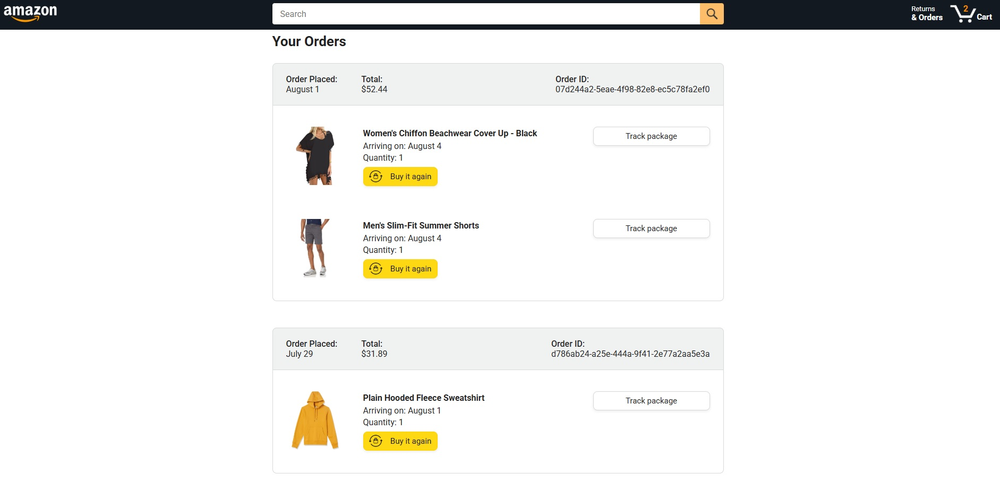

  <h1 align="center">
    Amazon Mock Page
  </h1>

 

# Objective
Practice Javascript e get more experience with more complex projects.
 
 

# Summary
The project is part of a free youtube course by <b>SuperSimpleDev</b>. Notes were taken before each step and worked from it as a way to not fall in "just follow the tutorial" trap.
It contains past versions of some codes and .js files because it changed throughout the course.
The project also uses Jasmine Framework for automated tests.
 
 

# Features
Main page with functional search bar, cart and order links. The product list uses backend data from the course;

 
 
Cart page with several options for each product. Also, dynamic payment summary;

 
 
Order page with functional search bar and links to Order/product delivery tracking;

 
 
dynamic tracking page with tracking bar and status highlight;

 
 

 
 

# Resources
<ul>
  <li>
    <a href="https://www.youtube.com/watch?v=EerdGm-ehJQ" alt=JavaScript Tutorial Full Course - Beginner to Pro">JavaScript Tutorial Full Course - Beginner to Pro</a>    
  </li>
</ul>
